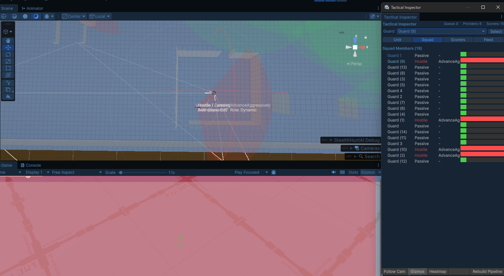
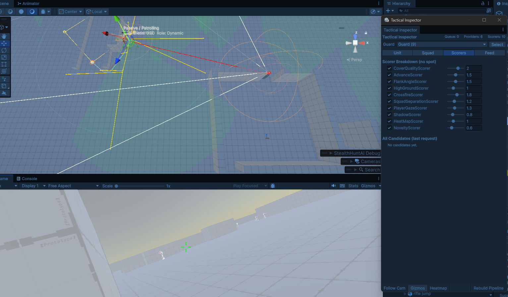
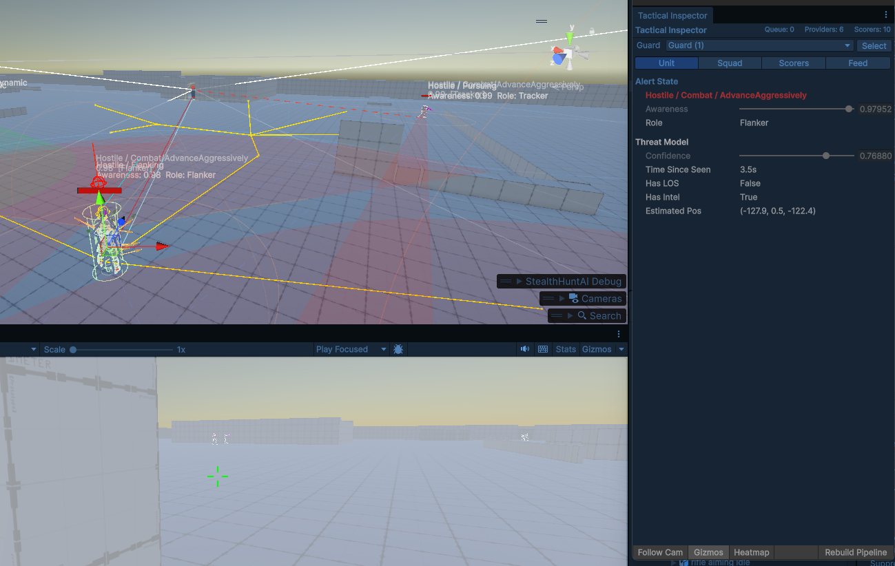
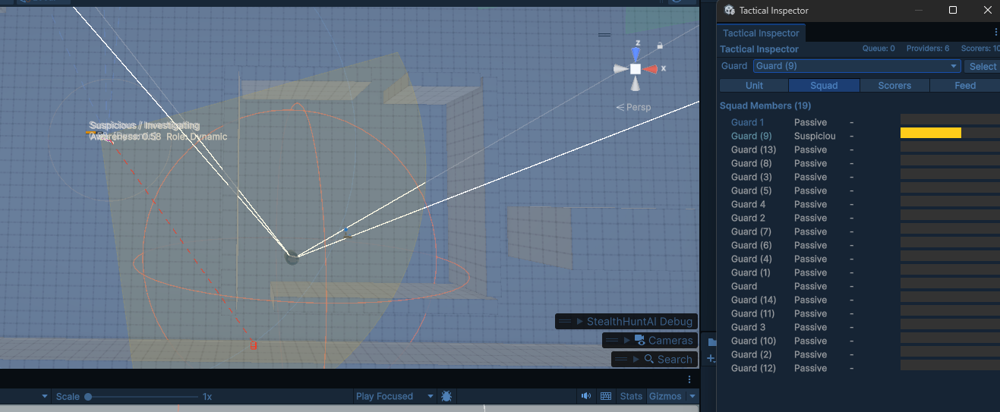

# StealthHuntAI

A Unity 6 stealth and combat AI system built for the Asset Store. Guards perceive, hunt, coordinate and breach — without scripted behaviour trees.

  

---



*Squad tab showing hostile guards advancing — heatmap overlay visible in scene view*

| | |
|---|---|
|  |  |
| *10 live scorers with tunable weights* | *Threat model — confidence, estimated position, time since seen* |



*Squad tab showing all 19 guards — one suspicious, rest passive*

---

## What it does

Guards react to sight, sound and the environment through a layered perception system. When they find you, they switch from stealth pursuit to coordinated combat — flanking, suppressing, breaching rooms and sharing intel across squads.

Inspired by the AI in **Alien Isolation**, **F.E.A.R.** and **Metal Gear Solid**.

---

## Architecture

The system is split into four assemblies:

```
StealthHuntAI.Core       Perception, HFSM, patrol, sound propagation
StealthHuntAI.Combat     GOAP planner, squad tactics, CQB
StealthHuntAI.Demo       Player controller, guard weapon, guard health
StealthHuntAI.Editor     Tactical Inspector, scene overlays
```

Core has no dependency on Combat — you can use the stealth system alone.

---

## Core features

**Perception**
- Layered awareness with sight, sound and memory
- Reaction delay — guards don't snap to alert instantly
- Sound propagation via NavMesh path finding with corner attenuation
- Light awareness via LightRegistry
- Markov flight prediction — guards learn where you tend to run
- Dead body detection — finding a dead colleague triggers alert

**Patrol**
- Manual waypoint patrol (Loop or PingPong)
- Tactical patrol — guards gravitate toward cold heatmap zones and PatrolPoint components automatically
- Guards spread across the scene without any scripting

**Alert system**
- Passive → Suspicious → Hostile state machine
- Squad-wide alert propagation — one guard spots you, the squad mobilises
- Guards share intel via SquadBlackboard and converge on your last known position
- Confidence decay — stale intel causes guards to search rather than rush

---

## Combat Pack features

**GOAP planner**

Guards plan sequences of actions toward tactical goals. Seven actions:

| Action | When used |
|---|---|
| TakeCover | On taking fire — peek, shoot, reposition |
| AdvanceAggressively | Pushing toward known position |
| Flank | Circling to a new angle |
| Suppress | Pinning player while squad repositions |
| HoldChokepoint | Defending a tactical zone |
| HighGround | Taking elevated position for Overwatch |
| Withdraw | Falling back when squad strength is low |

**Squad strategy**

`TacticalBrain` selects a squad-level strategy every few seconds:

- **Bounding** — pairs alternate suppress and advance
- **Pincer** — split flanks from opposite sides
- **Suppress** — one guard pins, others reposition
- **Overwatch** — one guard takes high ground, others advance below
- **Withdraw** — all guards fall back when heavily outnumbered

**Tactical pathfinding**

Guards never run across exposed ground. `TacticalPathfinder` builds waypoint chains with sightline checks — every intermediate position is verified against the threat before guards commit to a route.

**CQB — Close Quarters Battle**

Add `EntryPoint` components to doors. Guards automatically:

1. Stack beside the door
2. Coordinate entry type (Dynamic or Deliberate based on intel confidence)
3. Breach simultaneously and move to assigned points of domination
4. Sweep corners and signal clear

**Combat event bus**

F.E.A.R.-style interrupt system. Taking damage always triggers immediate cover-seeking, regardless of current action. Buddy death triggers suppression response.

---

## Setup

**Requirements**
- Unity 6
- AI Navigation package
- Input System package (for demo)

**Quick start**

1. Add `HuntDirector` to a GameObject in your scene
2. Add `StealthHuntAI` to your guard prefabs
3. Add `StealthTarget` to your player
4. Bake a NavMesh

Guards will patrol, detect and hunt automatically.

**Tactical patrol**

Place `PatrolPoint` components on doors, corridors and choke points. Guards without assigned waypoints will gravitate toward unvisited patrol points automatically.

**CQB**

Add `EntryPoint` to door GameObjects. Set stack positions and points of domination. Guards will use them automatically when threat confidence is high.

---

## Sound system

Sound propagates via NavMesh with corner attenuation. Configure per weapon in `PlayerCombat`:

| Weapon state | Typical radius | Guards react |
|---|---|---|
| Unsuppressed | 35m | Hostile immediately |
| Suppressed | 8m | Suspicious within 8m |
| Melee hit | 2.5m | Suspicious nearby |
| Stealth kill | 1m | Near-silent |

---

## Tactical Inspector

Window → StealthHuntAI → Tactical Inspector

Live debugging during play:
- **Unit tab** — alert state, threat confidence, current GOAP action
- **Squad tab** — all guards with awareness bars, current squad strategy
- **Scorers tab** — live cover evaluation breakdown with weight sliders
- **Feed tab** — tactical request stream

---

## Licence

Everything — Core and Combat Pack — is Apache 2.0.

Use it freely in personal and commercial projects. Attribution appreciated but not required by the licence.

Full licence text: [Apache 2.0](LICENSE)

---

## Inspiration

- Jeff Orkin — GOAP and F.E.A.R. AI architecture
- Alien Isolation — creature memory and search behaviour  
- Ready or Not — CQB stacking and breach mechanics
- Bad Company 2 — bounding overwatch feel
